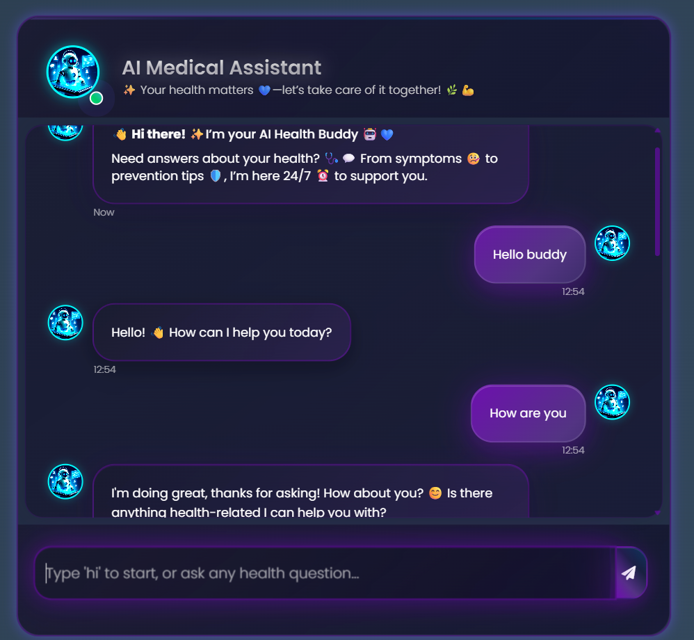
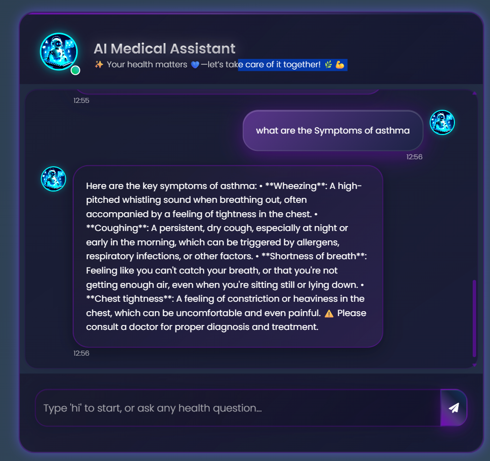

# 🏥 AI Medical Assistant Chatbot

<div align="center">



[](https://python.org)
[](https://flask.palletsprojects.com)
[](https://langchain.com)
[](https://pinecone.io)
[](LICENSE)

**An intelligent AI-powered medical assistant that provides accurate health information and answers medical questions using advanced NLP and vector search technology.**

[🚀 Live Demo](#) • [📖 Documentation](#features) • [🛠️ Installation](#installation) • [🤝 Contributing](#contributing)

</div>

---

## 📸 Screenshots

### 🏠 Main Chat Interface

*Clean and intuitive chat interface with real-time medical assistance*

### 💬 Medical Query Response

*Detailed and accurate medical information with proper formatting*

---

## ✨ Features

🔹 **AI-Powered Medical Assistant** - Advanced language model for accurate medical responses  
🔹 **Vector Database Integration** - Pinecone-powered semantic search for relevant medical information  
🔹 **Real-time Chat Interface** - Modern, responsive web interface with typing indicators  
🔹 **Medical Knowledge Base** - Comprehensive medical documents and drug information  
🔹 **Safety First** - Built-in disclaimers and professional medical advice recommendations  
🔹 **Mobile Responsive** - Works seamlessly across all devices  
🔹 **Conversation History** - Maintains context throughout the conversation  
🔹 **Smart Greetings** - Contextual responses for greetings and farewells  

---

## 🛠️ Tech Stack

| Category | Technology |
|----------|------------|
| **Backend** | Python 3.10+, Flask 2.3.3 |
| **AI/ML** | LangChain, Together AI (Llama-3-8b), HuggingFace Transformers |
| **Vector DB** | Pinecone Vector Database |
| **Frontend** | HTML5, CSS3, JavaScript (jQuery), Bootstrap 4 |
| **Document Processing** | PyPDF, Sentence Transformers |
| **Deployment** | Docker, Gunicorn, Render |

---

## 🚀 Installation

### Prerequisites
- Python 3.10 or higher
- Git
- Pinecone API Key
- Together AI API Key

### Step 1: Clone the Repository
```bash
git clone https://github.com/AnkanGhosh2004/Medical_AI_Chatbot.git
cd Medical_AI_Chatbot
```

### Step 2: Create Virtual Environment
```bash
# Using conda (recommended)
conda create -n medibot python=3.10 -y
conda activate medibot

# Or using venv
python -m venv medibot
# Windows
medibot\Scripts\activate
# macOS/Linux
source medibot/bin/activate
```

### Step 3: Install Dependencies
```bash
pip install -r requirements.txt
```

### Step 4: Set Up Environment Variables
Create a `.env` file in the root directory:
```env
PINECONE_API_KEY=your_pinecone_api_key_here
TOGETHER_API_KEY=your_together_api_key_here
```

### Step 5: Initialize Vector Database
```bash
python store_index.py
```

### Step 6: Run the Application
```bash
# Development mode
python app.py

# Production mode
gunicorn app:app --bind 0.0.0.0:8080
```

🌐 Open your browser and navigate to `http://localhost:8080`

---

## 🐳 Docker Deployment

### Build and Run with Docker
```bash
# Build the image
docker build -t medical-ai-chatbot .

# Run the container
docker run -p 8080:8080 --env-file .env medical-ai-chatbot
```

### Deploy to Render
The project includes `render.yaml` for easy deployment to Render cloud platform.

---

## 📂 Project Structure

```
Medical_AI_Chatbot/
├── 📁 src/                 # Source code modules
│   ├── __init__.py
│   ├── helper.py          # PDF processing and embeddings
│   └── prompt.py          # System prompts and instructions
├── 📁 Data/               # Medical documents and PDFs
│   ├── Drugs_Info.pdf
│   └── Medical_book.pdf
├── 📁 static/             # Static assets
│   ├── style.css         # Custom styling
│   └── logo.jpeg         # App logo
├── 📁 templates/          # HTML templates
│   └── chat.html         # Main chat interface
├── 📁 img/               # Screenshots and images
│   ├── 1.png
│   ├── 2.png
│   └── 3.png
├── 📁 research/          # Development notebooks
│   └── trials.ipynb
├── app.py                # Main Flask application
├── store_index.py        # Vector database setup
├── requirements.txt      # Python dependencies
├── Dockerfile           # Container configuration
├── render.yaml          # Render deployment config
└── README.md           # Project documentation
```

---

## 🔧 Configuration

### API Keys Setup
1. **Pinecone**: Get your API key from [Pinecone Console](https://app.pinecone.io/)
2. **Together AI**: Sign up at [Together AI](https://together.ai/) for LLM access

### Customization
- **Medical Documents**: Add PDF files to the `Data/` folder
- **Styling**: Modify `static/style.css` for UI customization
- **Prompts**: Update `src/prompt.py` for different response styles
- **Model**: Change the LLM model in `app.py`

---

## 🎯 Usage Examples

### Basic Medical Query
```
User: "What are the symptoms of diabetes?"
AI: Provides comprehensive diabetes symptoms with medical accuracy
```

### Drug Information
```
User: "Tell me about aspirin side effects"
AI: Lists aspirin side effects, contraindications, and usage guidelines
```

### General Health Questions
```
User: "How to maintain good heart health?"
AI: Offers evidence-based cardiovascular health tips
```

---

## 🚨 Important Disclaimers

⚠️ **Medical Disclaimer**: This AI assistant provides educational information only and should not replace professional medical advice, diagnosis, or treatment. Always consult qualified healthcare professionals for medical concerns.

🔒 **Privacy**: No personal health information is stored. All conversations are processed in real-time.

---

## 🤝 Contributing

We welcome contributions! Here's how you can help:

1. 🍴 Fork the repository
2. 🌿 Create a feature branch (`git checkout -b feature/AmazingFeature`)
3. 💾 Commit your changes (`git commit -m 'Add some AmazingFeature'`)
4. 📤 Push to the branch (`git push origin feature/AmazingFeature`)
5. 🔄 Open a Pull Request

### Areas for Contribution
- 🩺 Additional medical knowledge bases
- 🌍 Multi-language support
- 📱 Mobile app development
- 🔍 Advanced search capabilities
- 🧪 Testing and quality assurance

---

## 📋 Roadmap

- [ ] 🌐 Multi-language support
- [ ] 📱 Mobile app (React Native/Flutter)
- [ ] 🔊 Voice interaction capabilities
- [ ] 📊 Medical history tracking
- [ ] 🏥 Healthcare provider integration
- [ ] 🤖 Advanced AI models
- [ ] 📈 Analytics dashboard

---

## 📄 License

This project is licensed under the MIT License - see the [LICENSE](LICENSE) file for details.

---

## 👨‍💻 Author

**Ankan Ghosh**
- GitHub: [@AnkanGhosh2004](https://github.com/AnkanGhosh2004)
- LinkedIn: [Connect with me](https://linkedin.com/in/your-profile)

---

## 🙏 Acknowledgments

- 🤖 [LangChain](https://langchain.com) for the AI framework
- 🧠 [Together AI](https://together.ai) for LLM infrastructure
- 🔍 [Pinecone](https://pinecone.io) for vector database
- 🐍 [HuggingFace](https://huggingface.co) for embeddings
- 🌐 [Flask](https://flask.palletsprojects.com) for web framework

---

<div align="center">

**⭐ Star this repository if you found it helpful!**

Made with ❤️ for better healthcare accessibility

</div>

